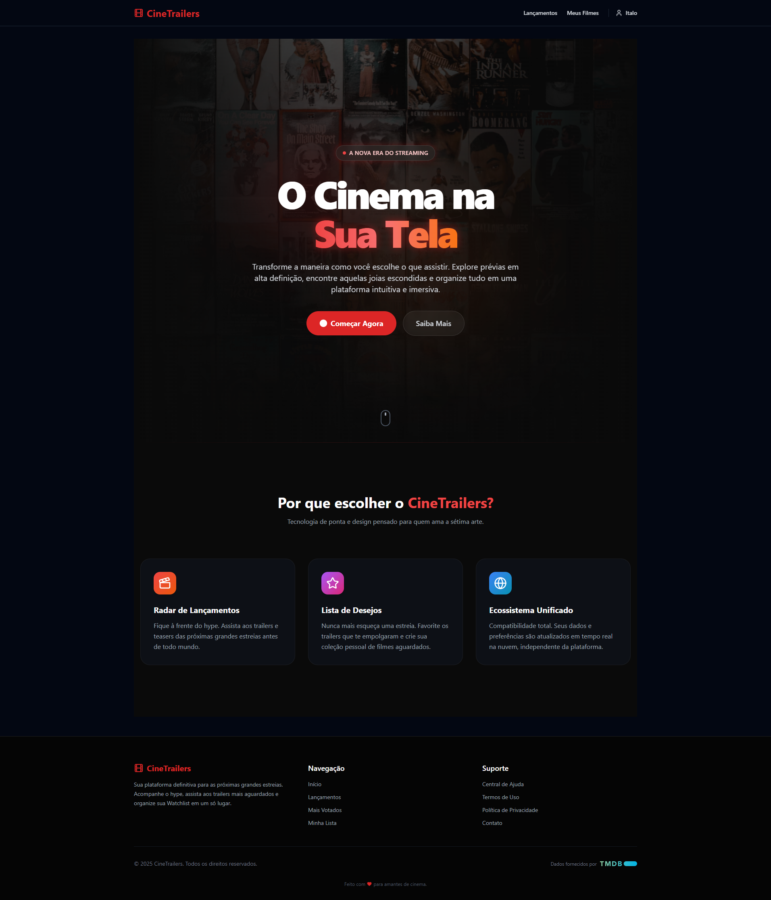
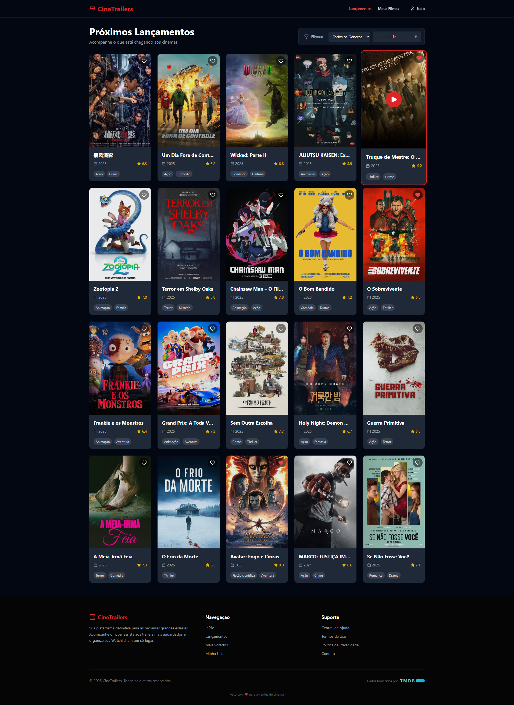

# 🎬 CineTrailers

CineTrailers é uma plataforma moderna e responsiva para amantes de cinema. O aplicativo permite explorar os lançamentos mais recentes, assistir a trailers em alta definição e criar uma lista personalizada de filmes favoritos.

## 🚀 Demonstração

[Visite o deploy](https://cinetraillers.netlify.app/)

## ✨ Funcionalidades

- **Exploração de Filmes**: Listagem automática dos filmes mais populares e lançamentos (via API do TMDB)
- **Trailers**: Reprodução instantânea de trailers oficiais do YouTube em um modal
- **Autenticação Completa**:
  - Login e Cadastro com E-mail/Senha (Firebase Auth)
  - Recuperação de senha via e-mail
  - Personalização de perfil (Nome de exibição)
- **Favoritos em Tempo Real**:
  - Adicione ou remova filmes da sua lista pessoal
  - Sincronização instantânea entre abas/dispositivos (Firestore Realtime)
- **Design Premium**: Interface escura (Dark Mode), responsiva e com animações suaves
- **Área de Suporte**: Formulário de contato funcional e páginas de ajuda integradas

## 🛠️ Tecnologias Utilizadas

- **React** - Biblioteca principal para construção da UI
- **Vite** - Build tool ultra-rápido para desenvolvimento
- **Tailwind CSS** - Framework de estilização para design ágil
- **Firebase** - Backend-as-a-Service (BaaS)
  - Authentication: Gerenciamento de usuários
  - Firestore: Banco de dados NoSQL
- **TMDB API** - Fonte de dados para filmes e trailers
- **Lucide React** - Ícones leves e bonitos

## 📸 Capturas de Tela

| Landing Page | Home Logada |
| :---: | :---: |
|  |  |

## ⚙️ Instalação e Configuração

### Pré-requisitos

- Node.js v16 ou superior
- Uma conta no TMDB (para obter a API Key)
- Um projeto no Firebase configurado

### Passo a Passo

1. Clone o repositório:

```bash
git clone https://github.com/ItaloBM/CineTrailers.git
cd cinetrailers
```

2. Instale as dependências:

```bash
npm install
```

3. Configure as Variáveis de Ambiente (.env.local):

```
VITE_TMDB_API_KEY=sua_chave_tmdb_aqui
VITE_FIREBASE_API_KEY=sua_firebase_api_key
VITE_FIREBASE_AUTH_DOMAIN=seu-projeto.firebaseapp.com
VITE_FIREBASE_PROJECT_ID=seu-projeto-id
VITE_FIREBASE_STORAGE_BUCKET=seu-projeto.appspot.com
VITE_FIREBASE_MESSAGING_SENDER_ID=seu_sender_id
VITE_FIREBASE_APP_ID=seu_app_id
```

4. Execute o projeto:

```bash
npm run dev
```

5. Abra http://localhost:5173 no seu navegador

## 🔒 Estrutura do Banco de Dados

Firestore Collections:

- `users/{uid}/favorites` - Filmes favoritos de cada usuário
- `messages` - Mensagens do formulário de contato

## 🤝 Contribuição

1. Faça um Fork do projeto
2. Crie uma Branch (`git checkout -b feature/NovaFeature`)
3. Faça o Commit (`git commit -m 'Adicionando nova feature'`)
4. Faça o Push (`git push origin feature/NovaFeature`)
5. Abra um Pull Request

## 📄 Licença

Este projeto está sob a licença MIT. Veja o arquivo [LICENSE](LICENSE) para mais detalhes.

---

<p align="center">
Feito com ❤️ por <a href="https://github.com/ItaloBM">Italo Butinholi Mendes</a>
</p>
